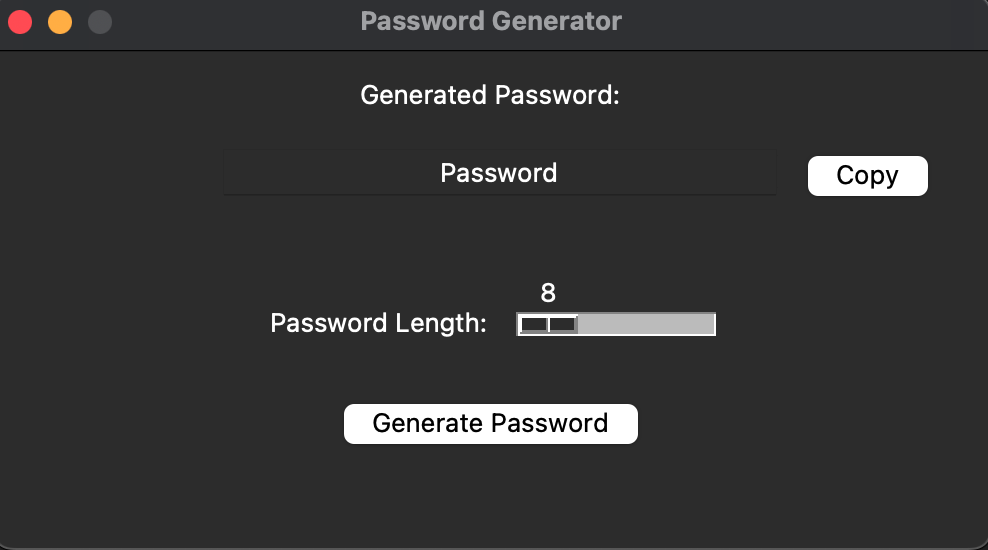
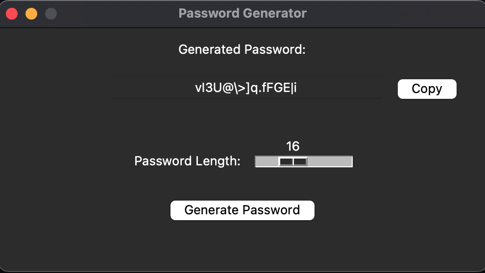

# Password Generator

- This tool helps you generate strong and secure passwords that mix lowercase letters, uppercase letters, numbers and special characters.

## Features
- Follows several industry standards and best practices for secure password generation
- Allows you to customise the length of the password you want to generate
- Easily regenerate new passwords of the same length without restarting the program
- Has a compy to clipboard function for ease of use

## Screenshots

*Main screen of the application*


*16 characters password successfully generated*

## How to Use
 Clone the repository: 
 ```
$ git clone https://github.com/yohannpirbay/password_generator.git
```
Navigate to the correct file: 
```
cd password_generator
```

Create a virtual environment: 
```
virtualenv venv
```

Activate the virtual environment: 
```
source venv/bin/activate
```

Install all required packages: 
```
pip3 install -r requirements.txt
```

Start the application: 
```
python3 main.py 
```

## Sources
The packages used by this application are specified in `requirements.txt`

## Author
- Yohann Pirbay

## License
- This project is licensed under the MIT License.

## Additional Info
- This small project was created as a way to combine my interests in cybersecurity with experimenting GUI development in Python with the `tkinter` library. 

